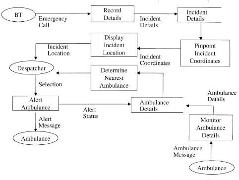

# London Ambulance Service Case Study

This case study is part of the Open Design Case Study project. This work is licensed under the Creative Commons Attribution-NonCommercial 3.0 ([CC BY-NC 3.0](https://creativecommons.org/licenses/by-nc/3.0/us/)) United States License.

### Citation

Human error and information systems failure: the case of the London ambulance service computer-aided despatch system project, Paul Beynon-Davies, 1999

### Title

Computer-Aided Dispatch System for London Ambulance

### Objectives

Understand the factors contributng to the failure of the dispatch system

### Stakeholder

- Munipical government
- Information system (IS) developers
- Ambulance crew
- Call operators
- Callers
- Patients

### Requirements

#### Description

- Call taking: Record information about incidents (e.g., location, time, patient condiitons) received through 999 calls
- Resource identification: Identify available ambulances and their locations
- Resource dispatch: Dispatch an available ambulance to an active incident case

#### Constraints

- Time from call received to resource dispatched should be less than 3 min 
- Time from dispatch to arrival at incident scene should be less than 11 min 

#### Quality Attributes

- Availability: The system should be available to receive calls at all times
- Scalability: The system should be able to handle a possible increase in the volume of calls
- Usability: Call operators should be able to efficiently locate available resources and dispatch them

### Environment

#### Entities and Assumptions

| Entities  | Assumptions  |
|---|---|
|  Ambulance | Connected to the GIS system; provides accurate information about its location and availability  |
| Ambulance crew | Responds to the dispatch request on timely manner  |
| Operator  | Accurately records the information about the incident from a given call |

### Design Solution

High-level system architecture 
- [Report of the Inquiry Into The London Ambulance Service (1993)]	(http://www0.cs.ucl.ac.uk/staff/A.Finkelstein/las/lascase0.9.pdf), pg 27

### Outcome

#### Failure

A model of the system failure
- [Human error and information systems failure: the case of the London ambulance service computer-aided despatch system project]	(http://bedford-computing.co.uk/learning/wp-content/uploads/2016/09/beynon-davies.pdf), pg 11

#### Suggested Usage

Can be used to demonstrate real-world example of ystem failure caused by multiple intertwined factors. 

### Other notes and resources

- [A Comedy of Errors: the London Ambulance Service case study, IWSSD (1996)](http://www0.cs.ucl.ac.uk/staff/a.finkelstein/papers/lascase.pdf)
- [Report of the Inquiry Into The London Ambulance Service (1993)]	(http://www0.cs.ucl.ac.uk/staff/A.Finkelstein/las/lascase0.9.pdf)
- [Understanding Failure: The London Ambulance Service Disaster, John Dob (2007)]	(https://link.springer.com/chapter/10.1007/978-1-84628-626-1_7)
- [Human error and information systems failure: the case of the London ambulance service computer-aided despatch system project]	(http://bedford-computing.co.uk/learning/wp-content/uploads/2016/09/beynon-davies.pdf)
